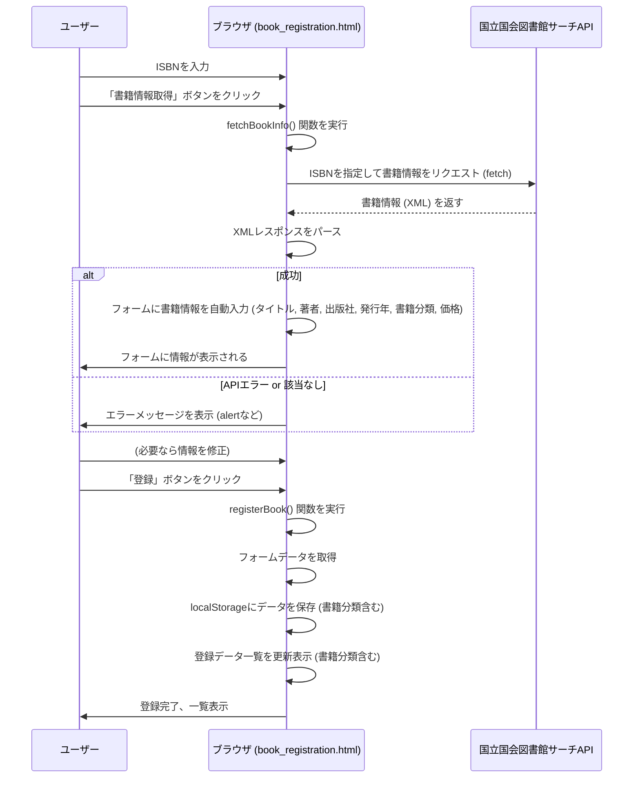

# 書籍登録機能改修計画 (国立国会図書館サーチ API 連携) - v2

## 1. 概要

`book_registration.html` を変更し、ISBN を利用して国立国会図書館サーチ API から書籍情報を取得し、フォームに自動入力する機能を追加します。さらに、API レスポンスから書籍分類と価格も取得・設定します。

## 2. HTML の変更

*   ISBN 入力フィールド (`#isbn`) の隣に「書籍情報取得」ボタンを追加します。
*   ボタンクリック時に、JavaScript の `fetchBookInfo()` 関数を呼び出すように `onclick` イベントハンドラを設定します。
*   フォームに「書籍分類」を表示するための読み取り専用フィールドを追加します (`id="category"`)。
*   登録データ一覧テーブルのヘッダーに「書籍分類」列を追加します。

## 3. JavaScript の実装

*   **`fetchBookInfo()` 関数の修正:**
    *   `#isbn` フィールドから ISBN を取得します。
    *   国立国会図書館サーチ API の OpenSearch エンドポイント (`https://ndlsearch.ndl.go.jp/api/opensearch`) に `isbn` パラメータを付与して `fetch` API でリクエストを送信します。
    *   レスポンス (XML) をパースし、以下の情報を抽出・設定します。
        *   タイトル: `<title>` 要素 → `#title` フィールド
        *   著者: `<author>` 要素 → `#author` フィールド
        *   出版社: `<dc:publisher>` 要素 → `#publisher` フィールド
        *   発行年: `<dcterms:issued>` 要素 (年のみ抽出) → `#issueYear` フィールド
        *   **書籍分類:** `<dcndl:NDC>` 要素の値の先頭1文字 (数字の場合のみ) → `#category` フィールド (読み取り専用)
        *   **価格:** `<dcndl:price>` 要素の値 (空の場合は `0`) → `#price` フィールド
    *   API 通信エラーや該当書籍なしの場合のエラーハンドリング (例: `alert` で通知) を実装します。
*   **既存関数の調整:**
    *   `registerBook()`:
        *   価格 (`#price`) の必須入力チェックを削除します。数値であるかのチェックは残します。
        *   `#category` フィールドの値を取得します。
        *   `saveBookData` 関数に `category` の値も渡します。
    *   `clearForm()`: ISBN フィールド (`#isbn`) と Category フィールド (`#category`) もクリアするように修正します。
    *   `addInitialData()`: **コメントアウト**して処理を無効化します。
    *   `saveBookData()`:
        *   引数に `category` を追加します。
        *   localStorage に保存するオブジェクトに `category` プロパティを追加します。
    *   `displayBookData()`:
        *   テーブルに「書籍分類」列のセルを追加します。
        *   localStorage から取得したデータオブジェクトの `category` プロパティ値を表示します。

## 4. API 仕様について

*   国立国会図書館サーチ API から取得した情報を利用します。

## 5. 処理フロー (Mermaid シーケンス図)

## 6. 初期データの扱い

*   既存の `addInitialData()` 関数は、コメントアウトして残します。